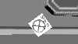
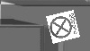
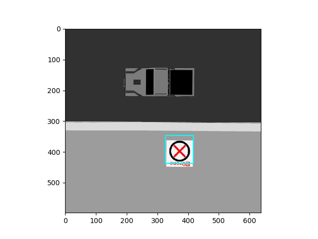

# Training and using Cascade Classifiers

## What are Cascade Classifiers?

>  "Object Detection using Haar feature-based cascade classifiers is an  effective object detection method proposed by Paul Viola and Michael  Jones in their paper, "Rapid Object Detection using a Boosted Cascade of Simple Features" in 2001. It is a machine learning  based approach where a cascade function is trained from a lot of  positive and negative images. It is then used to detect objects in other images."

From the OpenCV documentation [here](https://docs.opencv.org/3.4/db/d28/tutorial_cascade_classifier.html).

An intuitive understanding of the Haar Cascade is a smart template matching filter which we "scan" over the image. Do check [this article](http://www.willberger.org/cascade-haar-explained/) out which describes the background, read the bullet points in the end and see the visualization video to get a feel for how it works.

## Training Cascades:

Training Haar Cascades requires a lot of sample images. The sample images are categorized into two types:
i) Positive Samples: Images containing the pattern you want to detect, for e.g. photo of a brand logo
ii) Negative Samples: Images not containing the pattern you want to detect, these can be any photos not containing the brand logo.

Samples are required in the thousands in order to get robust detections!

Download the .zip file, it consists of the negative samples and the folder structure used in the commands below.

**Step 1: Creating positive samples**

Now, where will we find thousands of images of the landing pad you will have to detect?
The answer is we don't, we create them! We essentially take the image we want to detect, and overlay it on the negative sample images in varying positions, orientations and magnifications, and thus create positive samples.

In order to do this we need to have a folder containing all of negative images, and we create a .txt file containing all of the filenames in that folder. We will use this file to list all of the background images when creating positives. It looks like follows:

We can create this by using simple Python commands, I won't get into that here, just read and dump filename to a text file. Here is the file for the negative image folder shared with you all.

Back to creating the positives, we do this automatically, with the command:

```bash
opencv_createsamples -img landing_marker.jpg -bg bg.txt -info info/info.lst -maxxangle 0.1 -maxyangle 0.1 -maxzangle 1.6 -num 34320
```
where the parameters:
```-img``` specifies the image we want to overlay
```-bg``` takes the background file list
```-info``` creates a .lst file which lists the positions where the image is overlaid in each negative
```-num``` is the number of negatives
```-maxxangle -maxyangle -maxzangle``` are the amount of rotation which we want the positive images to vary in angles (in radians) along the x, y and z (roll, pitch and yaw) axes respectively.
The camera on our quadcopter does not have much distortion, hence x and y angles are kept low, since we are unlikely to encounter such scenarios.

Since there are 30k+ images, this operation might take a few minutes. These are some of the output images:

​                                                            

Now we have both the required positive and negative images!

In we will create a positives.vec file that will keep a record of our positives. We do that using the following command:

```bash
opencv_createsamples -info info/info.lst -num 34320 -w 24 -h 24 -vec positives.vec
```
where the parameters:
```-w``` & ```-h``` are the width and height of the samples respectively, 24 pixels is an optimal number, going above yields little benefits
```-vec``` specifies the file to be created

**Note**: You could merge the two above commands into one, then your info folder will not have the output positives, I have split them because in my case, I found that it takes longer for them to run together, and the results are inferior too, your mileage may vary.

**Step 2: Training**

Training involves a lot of parameters, we are going to keep most of the parameters to their default values. Refer to [this link](https://docs.opencv.org/3.2.0/dc/d88/tutorial_traincascade.html) if you want more information.
We can train our classifiers to either detect Haar like feature types or Local Binary Patterns (LBP). Haar features undergo floating point computation, while the LBP features just require integer computations. Thus while training, LBP is much much faster than Haar. There is no noticeable difference in the outcomes in our use case, hence we will be using LBP features. This process runs only on a single core of your CPU (requires OpenCV to be differently compiled to run on multiple cores), yet training using LBP in our case requires less than 10 minutes, compared to potentially hours if not days with the Haar Cascades.

Training involves feeding a certain number of positive and negative samples into each stage.

```bash
opencv_traincascade -data data -vec positives.vec -bg bg.txt -numPos 2287 -numNeg 2287 -numStages 15 -featureType LBP -w 24 -h 24
```
You will notice that while running this, it will not complete the full 15 stages we have given, this is because the false positive error rate will be reached at Stage 10 itself, the resulting output is perfectly usable and works well. You might add more negative images to refine the algorithm according to your decisions and thinking.

After the training is complete, you will notice that the cascades have been generated in the data folder, we will use these for our detection. These files can be used anywhere, their small size is one of the advantages of this technique.

**Step 3: Detection**

The link shared above contains a sample script. Refer to it.
Do learn and experiment with the various parameters, the most important ones are the scaleFactor and the max and min neighbor thresholds. Adjust them accordingly.
Here is a short script to detect the landing marker and display it

```python
import cv2
from matplotlib import pyplot as plt

logo_cascade = cv2.CascadeClassifier('data/cascade.xml')

img = cv2.imread('test_1.png')  # Source image
gray = cv2.cvtColor(img, cv2.COLOR_BGR2GRAY)

logo = logo_cascade.detectMultiScale(gray, scaleFactor=1.05)

for (x, y, w, h) in logo:
    cv2.rectangle(img, (x, y), (x + w, y + h), (255, 255, 0), 2)
plt.imshow(cv2.cvtColor(img, cv2.COLOR_BGR2RGB))
plt.show()

```
You can see the output below, notice the symmetric nature of the marker allows us to get away with a smaller angle range while creating the positives.
​                             


